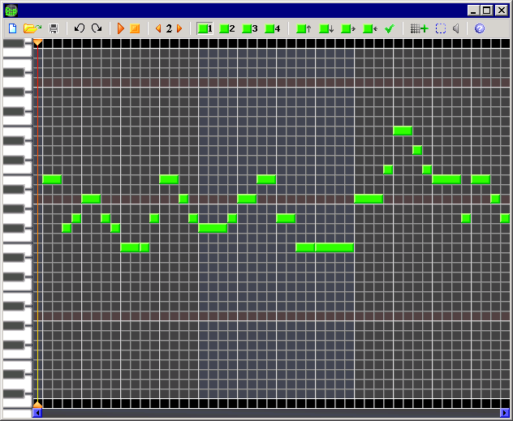

# bipcomposer-icons

This repository contains icons and a other graphical resources from my old BipComposer application, under a permissive license.

BipComposer was a desktop application I made with GameMaker around 2010. It was a visual editor that allowed to create and play
simple melodies for the onboard PC speaker. Though I abandoned the project a long time ago, it would have been a shame not to
share the retro pixel art resources I had made back then.
